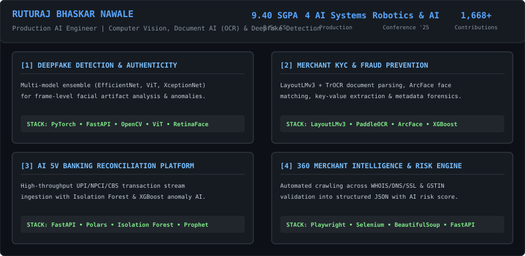

# ⚡ RUTURAJ BHASKAR NAWALE
### **Production AI Engineer | Computer Vision, Document AI (OCR), Deepfake Detection & Banking Analytics**

---

### 📊 AI Engineering Summary & Portfolio Highlights

 

 

## 🤖 Multi-Model AI Pipeline Architecture

  

 

## 🛠️ Technical Capabilities & AI Stack

| Domain | Technologies & Frameworks |
| :--- | :--- |
| **Deep Learning & Computer Vision** | `PyTorch` • `OpenCV` • `EfficientNet` • `Vision Transformer (ViT)` • `XceptionNet` • `RetinaFace` • `InsightFace` • `ArcFace` |
| **Document AI & OCR** | `LayoutLMv3` • `PaddleOCR` • `TrOCR` • `Key-Value Extraction` • `Image Forensics & Tampering Detection` |
| **Predictive Analytics & Fraud AI** | `XGBoost` • `Isolation Forest` • `Prophet` • `ARIMA` • `Risk Scoring Engines` • `Anomaly Detection` |
| **Backend & MLOps Infrastructure** | `Python` • `FastAPI` • `REST APIs` • `Polars` • `Pandas` • `BeautifulSoup` • `Selenium` • `Playwright` |
| **Databases & Tools** | `MSSQL Server` • `PostgreSQL` • `SQLite` • `JSON Pipelines` • `Git` • `Docker` |

 

## 🔬 Featured Production AI Engineering Platforms

<b>1. 🛡️ Deepfake Detection & Media Authenticity Verification System</b>

 

- **Core Tech**: `PyTorch`, `FastAPI`, `OpenCV`, `EfficientNet`, `Vision Transformer (ViT)`, `XceptionNet`, `RetinaFace`, `InsightFace`, `LLMs`
- **Key Achievements**:
  - Developed an end-to-end deepfake detection platform for image, video, and live-stream media authentication.
  - Implemented frame extraction, facial alignment, feature extraction, compression trace analysis, and temporal anomaly detection.
  - Built a multi-model ensemble detection engine identifying synthetic AI artifacts with low latency (<150ms/frame).

<b>2. 📄 Merchant Verification & Intelligent Fraud Detection Platform (KYC)</b>

 

- **Core Tech**: `LayoutLMv3`, `PaddleOCR`, `TrOCR`, `ArcFace`, `InsightFace`, `XGBoost`, `FastAPI`, `PyTorch`, `OpenCV`
- **Key Achievements**:
  - Engineered an AI-powered merchant KYC platform automating digital onboarding from document upload to automated approval/rejection.
  - Built intelligent document parsing via **LayoutLMv3** + **TrOCR** for structured key-value extraction and document tampering detection.
  - Integrated **ArcFace** biometric face matching and image metadata forensics to catch spoofing and identity fraud.

<b>3. 📊 AI 5V Reconciliation & Banking Intelligence Platform</b>

 

- **Core Tech**: `FastAPI`, `SQL Server`, `Polars`, `XGBoost`, `Prophet`, `ARIMA`, `Isolation Forest`, `REST APIs`, `LLMs`
- **Key Achievements**:
  - Designed an enterprise reconciliation platform handling high-volume banking transaction streams (UPI, NPCI, CBS).
  - Implemented anomaly detection and automated operational decision support using **Isolation Forest** & **XGBoost**.
  - Built 5 interactive intelligence dashboards: *Global, Transaction, Account (360° Profile), Predictive, and Resolution Intelligence*.

<b>4. 🌐 360° Merchant Profiling & Business Intelligence Engine</b>

 

- **Core Tech**: `FastAPI`, `BeautifulSoup`, `Selenium`, `Playwright`, `Pandas`, `JSON`, `REST APIs`, `LLMs`
- **Key Achievements**:
  - Developed an automated multi-source business profiling engine that constructs a complete 360° company intelligence report from a domain or GSTIN.
  - Automated crawling across WHOIS/DNS/SSL records, technology stack fingerprinting, social media, and GST/CIN registries into structured JSON with automated risk scoring.

 

## 📜 Research & Publications

> 🎓 **Consumer Sentiment Insights on Smart Ring Using Supervised Classifiers**
> - Conducted comparative sentiment analysis across multiple supervised ML classifiers.
> - Presented findings at the **National Conference on Robotics & AI (March 2025)**.

 

## 🖥️ Terminal Profile & Activity

<h3><code>ruturaj@github ~ $ whoami</code></h3>
<table>
  <tr>
    <td valign="top"></td>
    <td valign="top"></td>
  </tr>
</table>

  

<h3><code>ruturaj@github ~ $ ./contributions.sh</code></h3>

 

---

  Designed &amp; Developed by <b>Ruturaj Bhaskar Nawale</b> • AI Engineer

